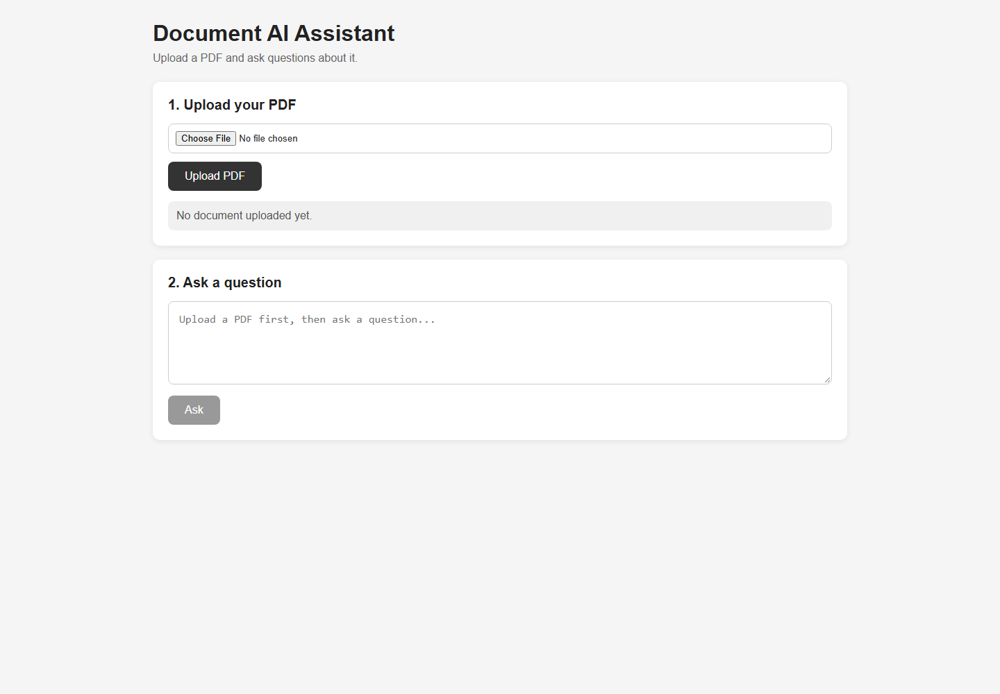
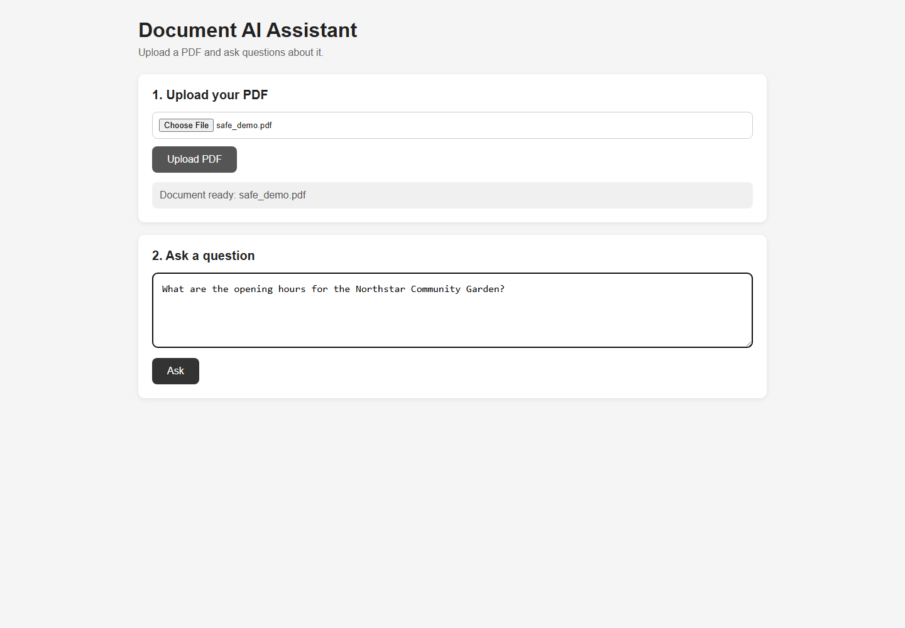
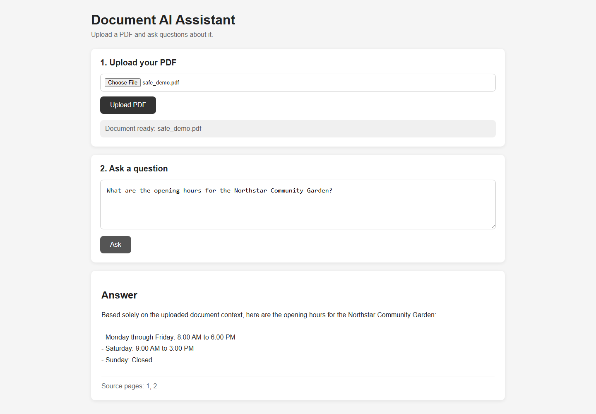
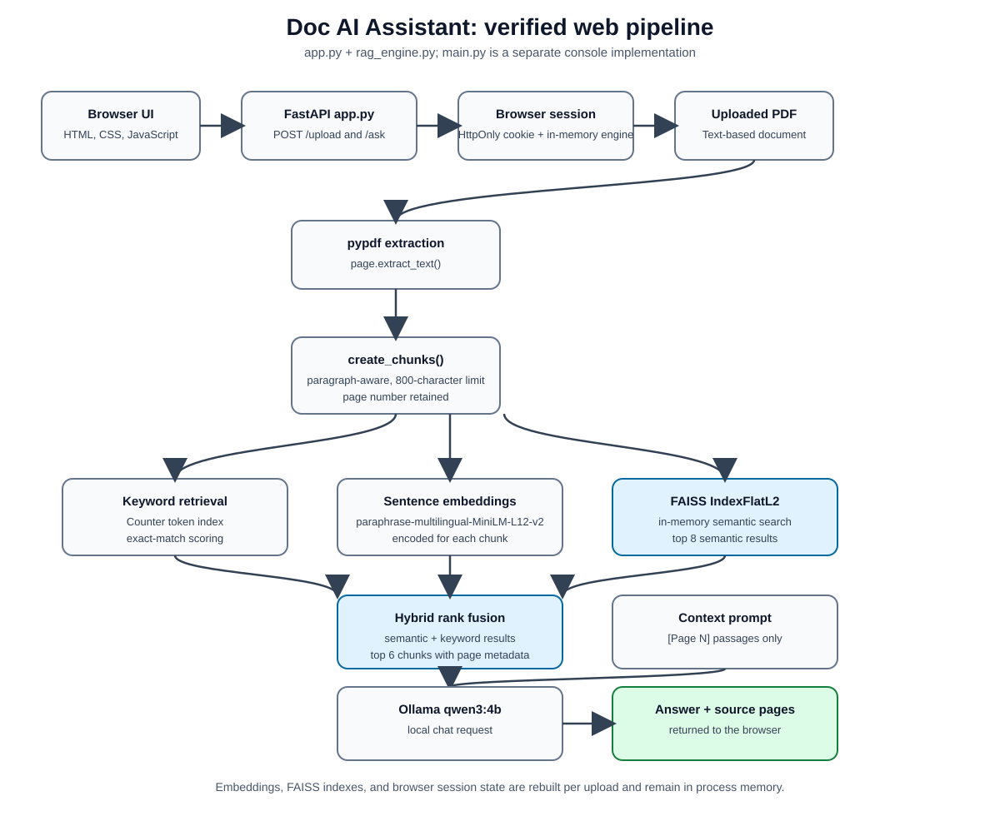

# Doc AI Assistant

Doc AI Assistant is a local PDF question-answering prototype. It lets you upload a text-based PDF, search its contents semantically and by keywords, and ask a local Ollama language model questions about the retrieved passages.

The project is intended as a practical RAG (retrieval-augmented generation) demonstration, not as a production document-management system.

## Screenshots

The following screenshots were captured from the live FastAPI application using a safe, temporary demo PDF. The demo PDF is not committed to the repository.



_Main interface with PDF upload and question controls._



_Document uploaded and question ready to submit._



_Example answer with source pages returned by the application._

## Overview

Long PDFs can be difficult to search when the information you need is spread across many pages. Doc AI Assistant addresses this by turning a document into searchable chunks and using those chunks as context for a language model.

In beginner-friendly terms, RAG works in two stages:

1. **Retrieve:** find the parts of the document that appear most relevant to your question.
2. **Generate:** send those passages to a language model and ask it to answer using only that context.

This helps the model ground its response in the uploaded document, although generated answers still need human review.

## Features

- PDF text extraction with `pypdf`.
- Text chunking with page numbers retained for the web RAG path.
- Multilingual sentence embeddings using `paraphrase-multilingual-MiniLM-L12-v2`.
- In-memory FAISS semantic search with `IndexFlatL2`.
- Keyword retrieval and simple hybrid rank fusion.
- Local question answering through Ollama using the `qwen3:4b` model.
- FastAPI web interface for PDF upload, questions, answers, and source-page display.
- Separate console entry points in `main.py` and `rag_engine.py`.

The web interface displays source page numbers returned by retrieval. These are retrieval metadata, not a guarantee that every sentence in a generated answer is directly supported.

## How It Works

The web application follows this pipeline:

```text
PDF
  -> extract text with pypdf
  -> split text into chunks while retaining page numbers
  -> generate multilingual sentence embeddings
  -> build an in-memory FAISS IndexFlatL2 index
  -> combine semantic and keyword retrieval results
  -> send the selected context to Ollama qwen3:4b
  -> display the generated answer and source pages
```

The embedding and vector index exist only in process memory. They are rebuilt for each upload session and are not persisted after the application restarts.



_The diagram follows the FastAPI web path in `app.py` and `rag_engine.py`. `main.py` is a separate console implementation with its own chunking and tokenization behavior._

The repository also contains `main.py`, a separate console implementation with its own chunking and tokenization behavior. It is not the same execution path as the FastAPI web application.

## Technology Stack

| Area | Technology |
|---|---|
| Backend | Python, FastAPI, Uvicorn, Pydantic |
| Upload handling | `python-multipart` |
| PDF processing | `pypdf` |
| Embeddings | `sentence-transformers` |
| Vector search | FAISS CPU, NumPy |
| Local LLM client | Ollama Python client |
| Frontend | HTML, CSS, and browser JavaScript served by FastAPI |

Models used by the current implementation:

- Embeddings: `sentence-transformers/paraphrase-multilingual-MiniLM-L12-v2`
- Ollama: `qwen3:4b`

## Project Structure

```text
doc_ai_assistant/
├── app.py                  FastAPI upload and question-answering service
├── main.py                 Separate console RAG implementation
├── rag_engine.py           Reusable PDF/RAG engine and console mode
├── templates/index.html    Web interface and browser JavaScript
├── docs/
│   ├── doc-ai-assistant-architecture.svg
│   └── images/
│       ├── main-interface.png
│       ├── document-question-workflow.png
│       └── example-answer-result.png
├── requirements.txt        Direct runtime Python dependencies
├── start_ai.bat            Windows Uvicorn launcher
├── .gitignore              Ignores environments, uploads, PDFs, caches, and logs
└── .venv/                  Local virtual environment (not committed)
```

`uploads/` is created at runtime for uploaded documents and is ignored by Git. The repository includes a direct-dependency manifest in `requirements.txt`, but it does not include a test suite or license file.

## Requirements

Install the direct runtime dependencies:

```powershell
python -m pip install -r requirements.txt
```

`requirements.txt` lists the packages imported by the application or required to launch it. Transitive dependencies are resolved by pip. A fresh environment may also need network access to download the embedding model on first use.

Ollama must be installed separately. The application expects the model to be available locally as:

```powershell
ollama pull qwen3:4b
```

The application does not start Ollama or pull the model automatically.

## Running Locally

These instructions use PowerShell on Windows.

### 1. Create and activate a virtual environment

From the project directory:

```powershell
python -m venv .venv
.\.venv\Scripts\Activate.ps1
```

### 2. Install the runtime packages

```powershell
python -m pip install -r requirements.txt
```

### 3. Install and start Ollama

Install Ollama from its local application, then run:

```powershell
ollama serve
ollama pull qwen3:4b
```

Keep Ollama configured to use a local endpoint if document locality is important.

### 4. Start the web application

Use the project-directory command rather than relying on the machine-specific path in the included batch file:

```powershell
.\.venv\Scripts\python.exe -m uvicorn app:app --host 127.0.0.1 --port 8000
```

Open `http://127.0.0.1:8000` in a browser.

`start_ai.bat` is included as a Windows convenience launcher, but it contains a hardcoded project path from another machine. Update that path before using it on a different computer. The batch file also starts Uvicorn on `0.0.0.0`, which exposes the development server beyond the local machine.

### 5. Upload a PDF and ask a question

1. Open the web interface.
2. Upload a text-based PDF.
3. Wait for extraction and indexing to complete.
4. Enter a question about the document.
5. Review the answer and the displayed source pages.

The web API uses `POST /upload` with a multipart `file` field and `POST /ask` with a JSON `question` field. The browser session is tracked with an HttpOnly, SameSite=Lax cookie; the in-memory session does not survive an application restart.

## Example

For a document describing an expense or reimbursement procedure, you could ask:

> According to this document, how many steps are required for the reimbursement process?

The application will retrieve relevant chunks, send them to the local Ollama model, and display the generated answer with source page numbers. The exact answer depends on the uploaded document and the model response.

## Console Modes

`rag_engine.py` can be run directly and prompts for a PDF path:

```powershell
.\.venv\Scripts\python.exe rag_engine.py
```

`main.py` provides a separate interactive console flow:

```powershell
.\.venv\Scripts\python.exe main.py
```

`main.py` expects a PDF in the current working directory and contains a document-specific example prompt. Uploaded PDFs and local documents are ignored by Git and are not part of the repository.

## Privacy and Local Processing

When Ollama is running on the local machine, PDF extraction, chunking, embeddings, FAISS search, keyword retrieval, and language-model inference are performed locally. The application does not configure or require OpenAI, Anthropic, Hugging Face API, AWS, or other cloud API credentials.

This should not be interpreted as a complete privacy or security guarantee:

- Uploaded PDFs are retained under `uploads/<session_id>/`; there is no deletion or retention policy.
- RAG indexes and session state are held in memory and disappear when the process restarts.
- The web application has no authentication, authorization, TLS, or upload-size limit.
- Upload filename and session-path handling should be reviewed before exposing the application to untrusted users.
- The embedding model may be downloaded from Hugging Face on first use.
- The application does not enforce that the Ollama endpoint is local; a remote Ollama configuration can send document context and questions elsewhere.

Treat this as a local prototype and do not expose it publicly without additional security hardening.

## Limitations

- Scanned or image-only PDFs are not supported because there is no OCR pipeline.
- Retrieval and indexes are in memory and are lost on restart.
- Multilingual semantic retrieval is provided by the embedding model, but keyword tokenization is limited; the console path handles ASCII words, while the web path has basic English and Chinese-character handling.
- Source pages are shown, but quoted passages and automatic claim-level verification are not implemented.
- The two console implementations do not have identical chunking, tokenization, or prompt behavior.
- There is no automated test suite, CI configuration, lint configuration, or type-check configuration.
- The project pins direct runtime dependencies in `requirements.txt`, but it does not include a lockfile for every transitive dependency.
- The web server is a development-style FastAPI service and is not hardened for multi-user or internet deployment.

## Future Improvements

- Add a lockfile or container definition for reproducible transitive dependency versions.
- Add OCR support for scanned PDFs.
- Add upload validation, filename sanitization, size limits, authentication, and TLS.
- Persist indexes and session state in a database or object store.
- Add unit and integration tests for extraction, chunking, retrieval, upload handling, and API behavior.
- Make the Ollama endpoint and model explicitly configurable and validate that it is local when required.
- Add quoted source passages, claim-level citations, and answer-verification checks.
- Separate the console and web RAG implementations or share one tested engine.
- Add deployment documentation for a hardened production environment.
